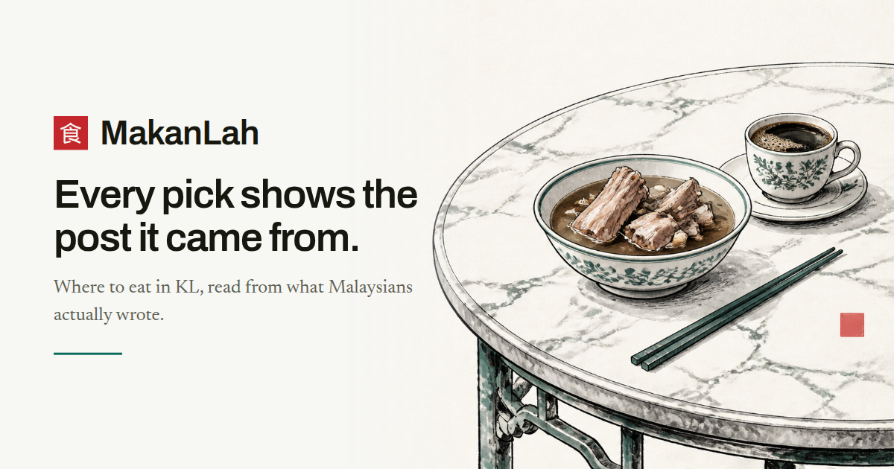
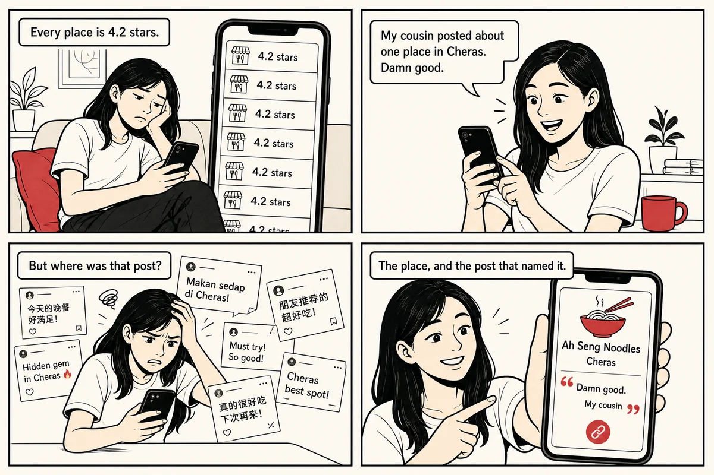
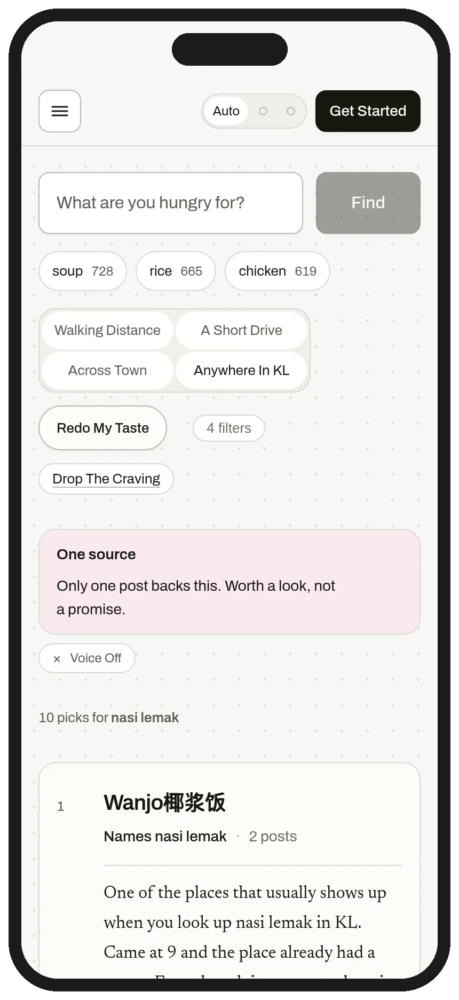
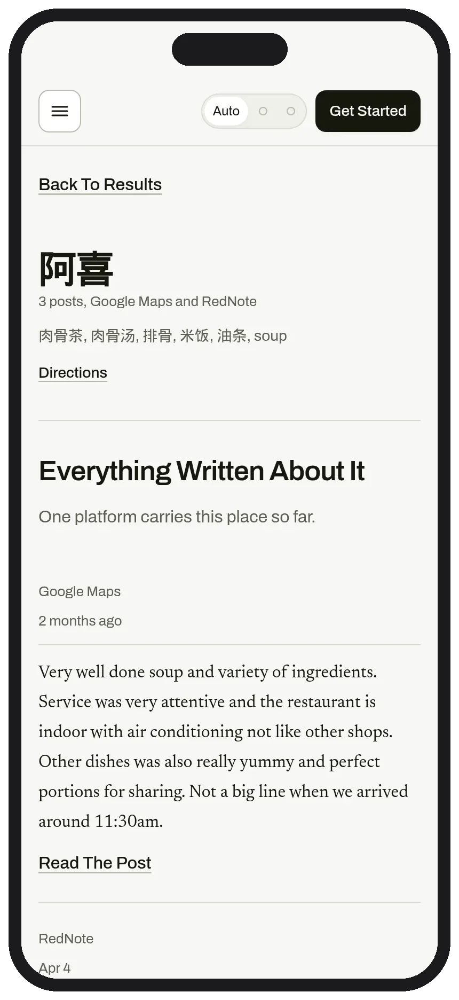
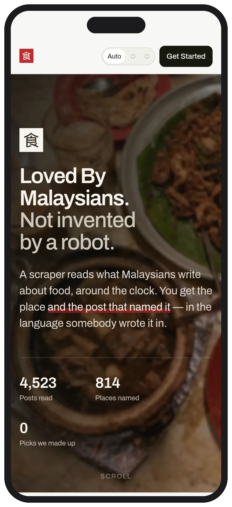
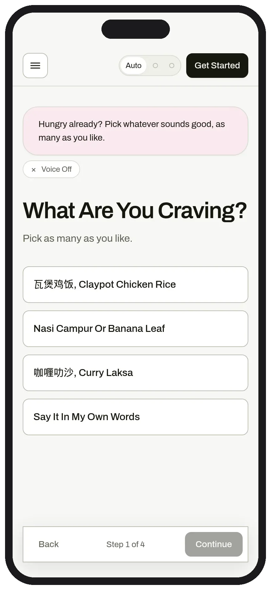
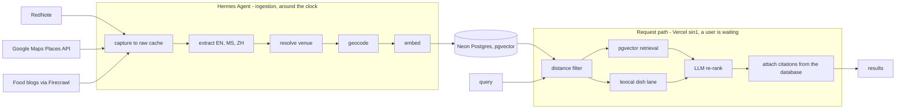
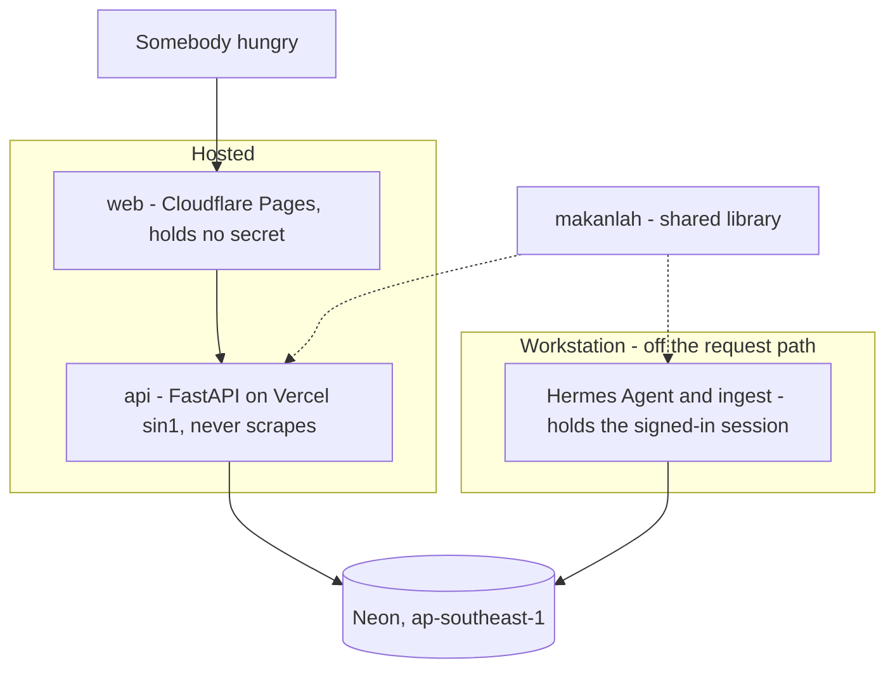
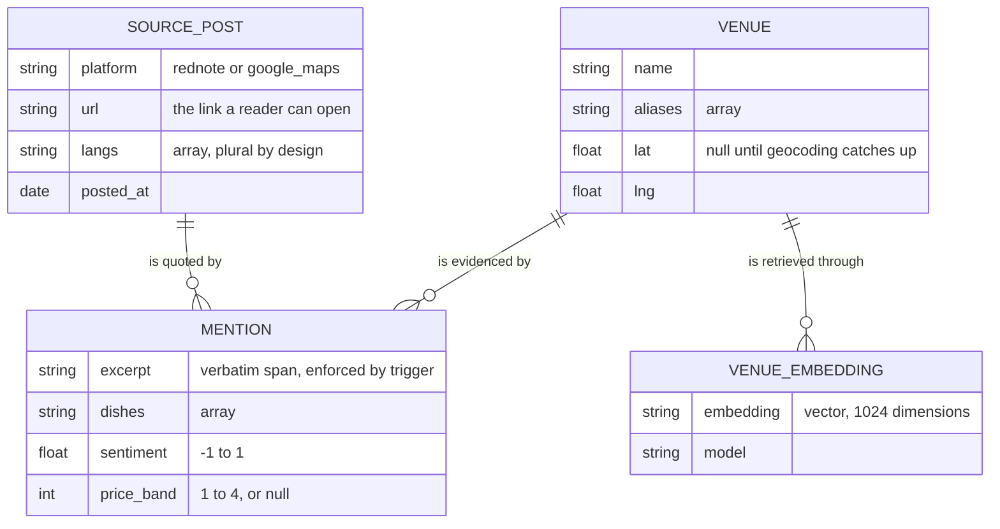

<a id="readme-top"></a>

<div align="center">
  

  <h3>MakanLah</h3>

  <p>
    <b>Restaurant recommendations for Kuala Lumpur, ranked by what Malaysians actually wrote.</b><br />
    Every pick shows you the post it came from. If nobody wrote it, we do not say it.
  </p>


[Live App](https://makanlah-b5h.pages.dev) · [API](https://makanlah-api.vercel.app/health) · [PRD](PRD.md) ·
[TRD](TRD.md) · [Runbook](runbook.md) · [Design](DESIGN.md)

</div>

## Table of Contents

<details>
  <summary>Expand</summary>
  <ol>
    <li><a href="#about-the-project">About The Project</a></li>
    <li><a href="#what-it-looks-like">What It Looks Like</a></li>
    <li><a href="#the-one-rule-that-governs-everything">The One Rule That Governs Everything</a></li>
    <li><a href="#how-it-works">How It Works</a></li>
    <li><a href="#what-is-in-the-corpus">What Is In The Corpus</a></li>
    <li><a href="#architecture">Architecture</a></li>
    <li><a href="#tech-stack">Tech Stack</a></li>
    <li><a href="#getting-started">Getting Started</a></li>
    <li><a href="#project-structure">Project Structure</a></li>
    <li><a href="#limitations">Limitations</a></li>
    <li><a href="#license">License</a></li>
    <li><a href="#team">Team</a></li>
  </ol>
</details>

---

## About The Project

Ask a Malaysian where to eat and they will not read you a star rating. They will tell you about a place, and usually who
told them. **MakanLah is that, mechanised.** It reads what people write about food in Kuala Lumpur — on RedNote and
Google Maps, in English, Malay and Chinese, often all three in one sentence — and ranks restaurants near you against
what you asked for.

The output is not a score. It is a restaurant, a distance, a price band, and **the post that made us mention it**,
quoted verbatim with a link you can open.



A Malaysian tester put the original problem plainly:

> I feel like the restaurants options are kinda limited. Why ah? A lot of the restaurants I know that have good reviews
> and popular also are not on the app wor.

He was right, and fixing him is most of what this repository is a record of.

<p align="right"><a href="#readme-top">&uarr;</a></p>

---

## What It Looks Like

|                                          Find                                           |                                       Evidence                                        |
| :-------------------------------------------------------------------------------------: | :-----------------------------------------------------------------------------------: |
|  |  |
|             <sub>Ranked picks, each carrying the post that named it.</sub>              |     <sub>Every post about one place, in whichever language it was written.</sub>      |

|                                       Arrive                                       |                                   Onboard                                   |
| :--------------------------------------------------------------------------------: | :-------------------------------------------------------------------------: |
|  |  |
|         <sub>4,523 posts read, 814 places named, 0 picks we made up.</sub>         |    <sub>Four questions, answered by a companion who cites nothing.</sub>    |

<div align="center">

<video src="https://github.com/TolongLabs/MakanLah/raw/main/docs/media/makanlah-demo.mp4" controls muted width="100%">
  <a href="https://github.com/TolongLabs/MakanLah/raw/main/docs/media/makanlah-demo.mp4">Watch the demo</a>
</video>

<sub>A walkthrough: landing, the taste wizard, a ranked search, one venue's full citation trail, and the copilot
answering from posts.
<a href="https://github.com/TolongLabs/MakanLah/releases/download/v0.1.0/narration.srt">Subtitles</a>.</sub>

<p><a href="https://makanlah-b5h.pages.dev"><b>Try It</b></a> · <a href="../scripts/demo/deck/index.html"><b>Deck</b></a></p>

</div>

<p align="right"><a href="#readme-top">&uarr;</a></p>

---

## The One Rule That Governs Everything

**A recommendation that cannot show you its source is not returned.**

Not softened, not flagged, not returned with a caveat — dropped before the response is built. This is enforced in SQL
rather than in prose: both retrieval paths inner-join the `mention` table, so a venue with no post behind it is
invisible to the ranker by construction, not by discipline.

It has consequences the product wears openly:

- A query the corpus cannot answer returns **nothing**, and says why, rather than returning something close
- Asked whether a place is halal, the copilot answers from a post or **admits it does not know**. It never infers from a
  name, a cuisine or a nearby landmark
- A price is shown when a writer named a figure or Google published one, and those two are **labelled differently**,
  because one cites a post and the other does not

<p align="right"><a href="#readme-top">&uarr;</a></p>

---

## How It Works

Two runtimes that never share a request. **Hermes Agent works the sources around the clock**, holding the browser
session and deciding what to read next. The API is hosted, reads a normalized corpus, and **never fetches from a
platform while a user waits**.



An exact dish match takes the lexical lane and goes in front of the semantic results. The two lanes exist because
`roti canai` and _"something not too heavy"_ are different questions, and one retriever answers them both badly.

The re-rank decides order; **citations are attached afterwards, from the database**. A model is never asked to produce a
URL, because a model asked for a URL produces a plausible one.

<p align="right"><a href="#readme-top">&uarr;</a></p>

---

## What Is In The Corpus

Measured, not estimated. Regenerate any of these from `/health` or the queries in [`runbook.md`](runbook.md).

|                               |           |
| ----------------------------- | --------- |
| Venues                        | **823**   |
| With evidence (recommendable) | **814**   |
| Carrying a price              | **627**   |
| Posts                         | **4,523** |
| Mentions (post ↔ venue)       | **4,764** |
| Distinct authors              | **2,190** |
| Platforms                     | **2**     |

**Recommendable is not the same as reachable, and the second is the honest one.** Across a fixed battery of 46 real KL
queries, **~250 distinct venues** come back — about 30% of what is citable. The gap is retrieval, not coverage, and it
is measured rather than estimated: filling ~325 of 920 available result slots, median 5 to 7.5 results per query, and
**no query returning nothing**.

Language is a correctness requirement here rather than a feature. Posts arrive in English, Malay and Chinese and
code-switch mid-sentence, so `source_post.langs` is an array by design — a single-language column would erase the thing
the corpus actually is.

<p align="right"><a href="#readme-top">&uarr;</a></p>

---

## Architecture

Three deployables and one shared library. The library exists so the corpus schema, the embedding client and the language
handling are written once and imported by two processes that otherwise share nothing.



| Piece       | Runs               | Job                                                         |
| ----------- | ------------------ | ----------------------------------------------------------- |
| `ingest/`   | Workstation, batch | Holds the signed-in browser session. Never serves a request |
| `api/`      | Vercel, Singapore  | Reads the corpus. Never scrapes                             |
| `web/`      | Cloudflare Pages   | Static, installable, holds no secret                        |
| `makanlah/` | Imported by both   | Schema, ranking, text handling, model clients               |

### The Citation Trail, As Tables

`mention` is the join that makes the product's one rule structural. Both retrieval paths inner-join it, so a venue with
no post behind it cannot be selected — the guarantee lives in the schema rather than in a code path somebody could
forget.



**`mention.excerpt` is enforced by a database trigger, not by convention.** The spike caught the extractor returning
excerpts that read correctly and were not in the post, stitched from non-contiguous lines. A fabricated quote behind a
citation is worse than no citation at all.

**No single source is load-bearing.** That is an uptime commitment, not legal cover: any one platform can go dark
mid-sprint, and a data layer with one point of failure goes dark with it. Google Maps carries most of the evidence and,
since it became a discovery source of its own, can also introduce venues RedNote never mentioned.

Deeper detail — API contracts, the corpus schema, ranking stages and the reasoning behind each — is in
[`TRD.md`](TRD.md), which is canonical over this file for anything technical.

<p align="right"><a href="#readme-top">&uarr;</a></p>

---

## Tech Stack

Everything below is what the code actually resolves to at runtime, not what the `.env.example` reserves a name for. The
last table is the difference between the two.

**Runtime And Hosting**

| Layer   | Choice                                   | Why                                                               |
| ------- | ---------------------------------------- | ----------------------------------------------------------------- |
| Corpus  | Neon Postgres, `pgvector` + `pg_trgm`    | One store for rows, full-text and vectors, in one region          |
| API     | FastAPI + Uvicorn on Vercel (`sin1`)     | Python, so the corpus layer is shared with ingestion              |
| Client  | React 19, React Router 7, Vite 7 → Pages | A PWA installs in seconds; an app store is a five-minute tax      |
| Mascot  | `pixi.js` 6 + `pixi-live2d-display`      | WebGL canvas, the only heavy dependency in the bundle             |
| Runtime | Python ≥ 3.11, `psycopg` 3, `pydantic`   | Five third-party packages total; the rest is the standard library |

**Models — Five Lanes, Deliberately Not Shared**

| Lane       | Model                      | Provider                   | Why It Is Its Own Lane                              |
| ---------- | -------------------------- | -------------------------- | --------------------------------------------------- |
| Extraction | `qwen-plus-2025-07-28`     | DashScope Intl (Singapore) | Batch. Strong on Chinese, and the corpus is RedNote |
| Embeddings | `text-embedding-v3`        | DashScope, 1024 dimensions | Genuinely multilingual — a weak one biases silently |
| Re-rank    | `qwen3.7-flash-2026-07-15` | DashScope                  | Interactive, 96% of request latency, thinking off   |
| Copilot    | `qwen3.7-flash-2026-07-15` | DashScope                  | A wrong citation is worse than a wrong ordering     |
| Companion  | `gemini-3.5-flash-lite`    | Google, free tier          | Sees no corpus row, names no venue, makes no claim  |

**Ingestion**

| Tool                                       | Job                                                                                               |
| ------------------------------------------ | ------------------------------------------------------------------------------------------------- |
| **Hermes Agent**                           | The agent behind the corpus. Runs the ingestion loop around the clock, deciding what to read next |
| **Firecrawl**                              | The open-web lane. Food blogs, listicles and review sites, rendered and parsed                    |
| Chrome DevTools Protocol over `websockets` | RedNote, against a signed-in Chrome. No Playwright, no key                                        |
| Google Places API (New)                    | Text Search (Pro) and Place Details (Enterprise) field masks                                      |
| Nominatim (OpenStreetMap)                  | Geocoding where Places does not resolve a name                                                    |
| OpenCC                                     | Folds simplified and traditional Han so one shop is one row                                       |

**Tooling**

| Job              | Tool                                                                   |
| ---------------- | ---------------------------------------------------------------------- |
| Package managers | Bun (JS), uv (Python)                                                  |
| Lint and format  | Biome, Prettier, Ruff — split by extension so neither undoes the other |
| Tests            | pytest, Vitest, Testing Library, jsdom                                 |
| Visual checks    | Playwright, headless — contrast, mascot, motion, overflow              |
| Commit gates     | commitlint + husky + lint-staged, Conventional Commits                 |

<p align="right"><a href="#readme-top">&uarr;</a></p>

---

## Getting Started

Full instructions, including seeding a corpus from scratch, are in **[`runbook.md`](runbook.md)**. The short version:

```bash
bun install                       # dev tooling and git hooks
uv sync                           # Python dependencies
cp .env.example .env              # then fill in DATABASE_URL and the model keys

uv run python -m makanlah.migrate # create the schema
scripts/dev-api.sh                # FastAPI on :8000
cd web && bun run dev             # client on :5173
```

Checks, all of which CI runs:

```bash
bun run lint        # biome + prettier + ruff
bun run typecheck   # tsc --noEmit, from web/
uv run pytest -q    # 661 tests, entirely against fixtures
```

**The test suite never touches a live platform.** That is deliberate: a test that scrapes is a test that fails when
somebody else ships.

<p align="right"><a href="#readme-top">&uarr;</a></p>

---

## Project Structure

```
makanlah/           shared library. Both runtimes import it, neither shares runtime state
  config.py         settings from the environment. Names keys, never prints a value
  db.py             the only module that speaks SQL
  models.py         extract, embed and re-rank clients
  rank.py           the four ranking stages
  copilot.py        one question about one venue, answered from the corpus or not at all
  dishes.py         dish matching. Whole-word for Latin, substring for Han
  prices.py         a price band read from post text, or nothing
  prefs.py          which wizard answers actually shaped a response
  text.py           venue normalization and language detection
  migrations/       the corpus schema, as Postgres

ingest/             batch, on the workstation
  places_api.py     Google Places. Replaced browser scraping for enrichment
  enrich_places.py  reviews and price for a venue, one HTTP call each
  discover_gmaps.py Maps as a source of venues, not only an annotation on them
  capture_rednote.py  fetch to the raw cache. Separate from extraction on purpose
  pipeline.py       raw -> extract -> resolve venue -> geocode -> embed
  cdp.py            CDP client. Every call bounded, because a crashed tab hangs silently

api/main.py         the interactive runtime
web/                the static client
tests/              pytest, against fixtures only
evals/              pinned ground truth and a runner for ranking quality
docs/               this file, PRD, TRD, runbook, design system, decision records
scripts/            bootstrap, deploy, browser session, visual checks
```

<p align="right"><a href="#readme-top">&uarr;</a></p>

---

## Limitations

Stated because a README that lists only strengths is not describing software.

- **Kuala Lumpur only.** Every area, dish vocabulary and geocoding bound assumes the Klang Valley
- **Coverage is uneven by dish.** Common dishes return ten results; a narrow query may return one or none, and the app
  says so rather than substituting
- **Freshness is a background concern.** The corpus is refreshed by a batch run on a workstation. Nothing refreshes on a
  user request, by design
- **p95 latency is over target.** The PRD asks for 3s; the re-rank pass makes it slower. Trading it for more results was
  a deliberate call, tracked as an open issue
- **Some venues are two rows.** Simplified and traditional Han spellings of one shop can survive as separate venues. A
  wrong merge is not recoverable, so ambiguity is kept rather than guessed
- **No photos.** Google's terms forbid caching Places imagery, and RedNote's CDN refuses hotlinking, so every available
  path was partial coverage plus a terms risk. Stock food photography was rejected outright — a picture of someone
  else's nasi lemak on a card whose whole argument is provenance is a hallucinated citation with a lens on it

<p align="right"><a href="#readme-top">&uarr;</a></p>

---

## License

Distributed under the MIT License. See [LICENSE](../LICENSE) for details.

Content in the corpus belongs to the people who wrote it. This repository contains **no scraped content** — the schema,
fixtures and code are here; `data/` is not, and never was.

<p align="right"><a href="#readme-top">&uarr;</a></p>

---

## Team

Built by **TolongLabs**.

<div align="center">
<table>
  <tr>
    <td align="center" width="25%">
      <a href="https://github.com/AlaskanTuna"></a><br />
      <b>Adam</b><br />
      <a href="https://github.com/AlaskanTuna">@AlaskanTuna</a><br />
      <sub>Fullstack, DevOps, agent and scraping pipeline</sub>
    </td>
    <td align="center" width="25%">
      <a href="https://github.com/chaosiris"></a><br />
      <b>LH</b><br />
      <a href="https://github.com/chaosiris">@chaosiris</a><br />
      <sub>Backend, agent and scraping pipeline</sub>
    </td>
    <td align="center" width="25%">
      <a href="https://github.com/DrxgClanPC"></a><br />
      <b>Jin Siang</b><br />
      <a href="https://github.com/DrxgClanPC">@DrxgClanPC</a><br />
      <sub>Ideation and testing</sub>
    </td>
    <td align="center" width="25%">
      <a href="https://github.com/Doraemon-00"></a><br />
      <b>Jun Song</b><br />
      <a href="https://github.com/Doraemon-00">@Doraemon-00</a><br />
      <sub>Documentation and testing</sub>
    </td>
  </tr>
</table>
</div>

<p align="right"><a href="#readme-top">&uarr;</a></p>
